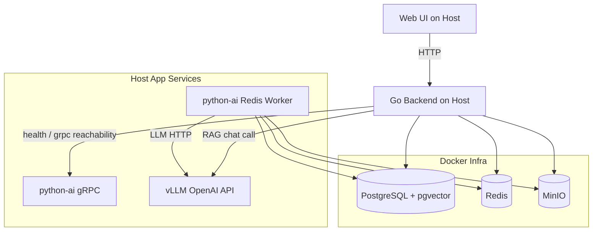

# ThinkBank - Intelligent Personal Data Asset Management System
## Product Requirement Document (PRD)

### 1. Project Overview
**ThinkBank** is a self-hosted, privacy-first personal data management system. It acts as a smart gallery and second brain for images/documents, with local AI processing and searchable knowledge retrieval.

**Core Goals**
- Data stays local (object storage + metadata + vectors are self-hosted).
- Uploaded assets are asynchronously parsed/captioned/vectorized.
- Users can perform character-based retrieval (Chinese/English mixed) and RAG chat across images/documents.

---

### 2. Current Deployment Mode (Actual Running State)

#### 2.1 Hybrid Deployment (Current Recommended)
- **Docker (infrastructure only):**
  - PostgreSQL + pgvector
  - Redis
  - MinIO
- **Host machine (application services):**
  - vLLM (OpenAI-compatible API)
  - python-ai gRPC service
  - python-ai Redis worker
  - go-backend (Hertz API gateway)
  - web-ui (Vite + React)

This mode is required for current environment constraints and GPU stability.

#### 2.2 Resource Scheduling Strategy (RTX 4070 8GB)
- **GPU exclusive:** only vLLM uses GPU.
- **CPU split:** python-ai embeddings/vision/doc parsing run on CPU.
- **Service contract:**
  - `LLM_API_URL=http://127.0.0.1:8000/v1`
  - `LLM_API_KEY=sk-local`

---

### 3. Technology Stack

#### 3.1 Backend (Gateway)
- Language: Go (Hertz)
- Protocols:
  - External: REST API
  - Internal to AI: gRPC (python-ai)

#### 3.2 AI Layer
- Language: Python 3.11+
- LLM client: `langchain-openai` (OpenAI-compatible HTTP)
- Inference server: host vLLM
- Embedding/CV runtime: CPU only (`device='cpu'`)
- Main models:
  - LLM: `Qwen/Qwen2.5-7B-Instruct-GPTQ-Int4` (vLLM)
  - Text embedding: `BAAI/bge-m3`
  - Image caption / vision: current configured vision model in `python-ai/core/vision.py`

#### 3.3 Data Layer
- PostgreSQL 16 + pgvector
- Redis 7
- MinIO (S3 compatible)

#### 3.4 Frontend
- React + Vite + Tailwind + shadcn/ui

---

### 4. System Architecture



---

### 5. Key Workflows

#### 5.1 Asset Ingestion (Async)
1. Upload file to `/api/v1/assets/upload`.
2. Backend writes object to MinIO and metadata to PostgreSQL.
3. Backend pushes task ID to Redis queue.
4. `python-ai` worker consumes task:
   - image: generate caption + embeddings
   - document/text: extract content + semantic embedding
5. Worker writes caption/content/embedding and marks status (`COMPLETED` / `FAILED`).

#### 5.2 Character-Based Retrieval
1. User inputs query in Search page.
2. Frontend calls `GET /api/v1/search?q=...`.
3. Backend performs character-level matching/scoring over filename, mime, caption, content text.
4. Backend returns ranked results and presigned MinIO URLs.

#### 5.3 RAG Chat (Image + Document Context)
1. User sends message to `POST /api/v1/chat`.
2. Backend retrieves top-K relevant assets via character retrieval.
3. Backend assembles context (caption/content preview/file metadata).
4. Backend calls host vLLM OpenAI API to synthesize answer.
5. Response returns `answer + sources` (source files for traceability).

---

### 6. Database Schema (Current)

#### 6.1 `assets`
- `id` (UUID)
- `bucket_name`
- `object_name`
- `mime_type`
- `size_bytes`
- `caption`
- `content_text`
- `metadata` (JSONB)
- `processing_status` (`PENDING|PROCESSING|COMPLETED|FAILED`)
- `created_at`, `updated_at`

#### 6.2 `asset_embeddings`
- `asset_id` (PK/FK)
- `semantic_vector` (vector)
- `visual_vector` (vector)

#### 6.3 `processing_tasks`
- status/stage/progress/error tracking for async pipeline

---

### 7. API Specification (Implemented)

#### 7.1 Asset APIs
- `POST /api/v1/assets/upload`
- `GET /api/v1/assets`
- `GET /api/v1/assets/:id`
- `DELETE /api/v1/assets/:id`

#### 7.2 AI Health API
- `GET /api/v1/ai/health`
- Returns:
  - `available` (python-ai gRPC availability)
  - `llm_available`
  - `llm_url`
  - `llm_message`

#### 7.3 Retrieval + RAG APIs
- `GET /api/v1/search?q={text}&limit={n}&threshold={f}`
- `POST /api/v1/chat`
  - request: `{ query, history, top_k }`
  - response: `{ answer, sources[] }`

---

### 8. Non-Goals / Deferred
- Full multi-modal vector nearest-neighbor endpoint is not yet exposed as dedicated public REST API.
- Streaming chat response is not yet enabled in current REST `/chat` implementation.

---

### 9. Project Structure

```text
thinkbank/
├── docker-compose.yml          # Infra services (postgres/redis/minio)
├── start-infra.sh              # Start Docker infra only
├── start-host-app.sh           # Start host app services
├── go-backend/                 # Go API gateway
├── python-ai/                  # gRPC service + worker
├── web-ui/                     # Frontend
├── check_arch.py               # Runtime architecture check
└── PRD.md
```

