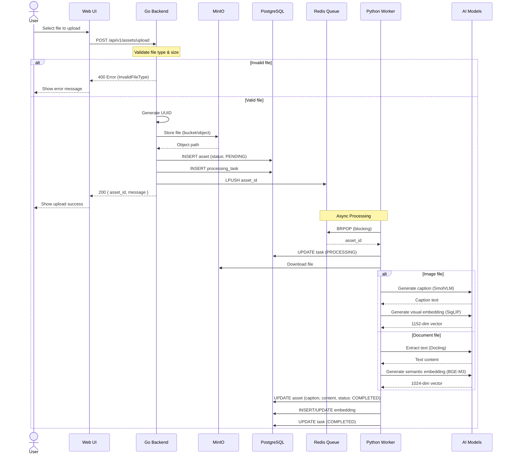
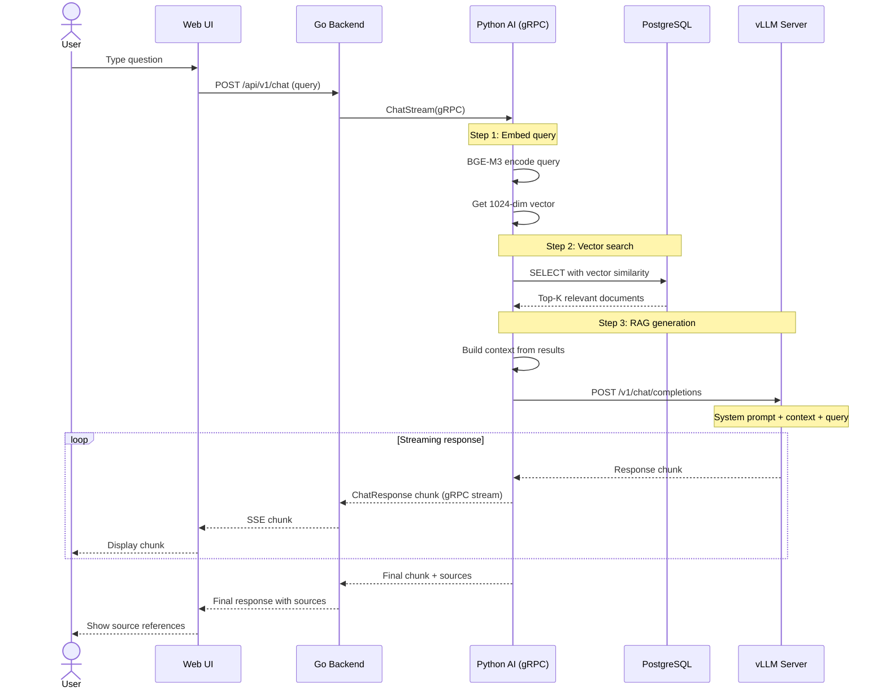
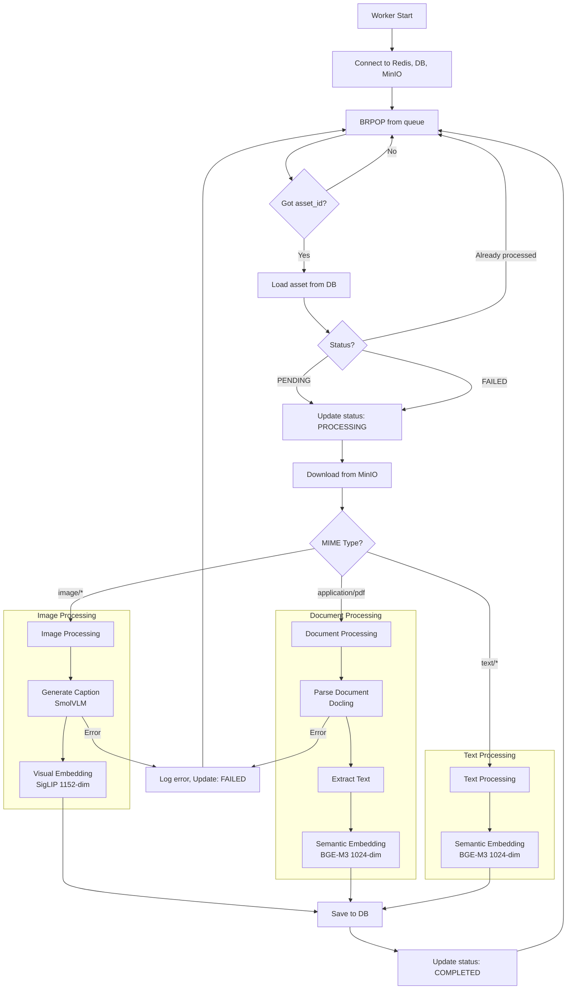
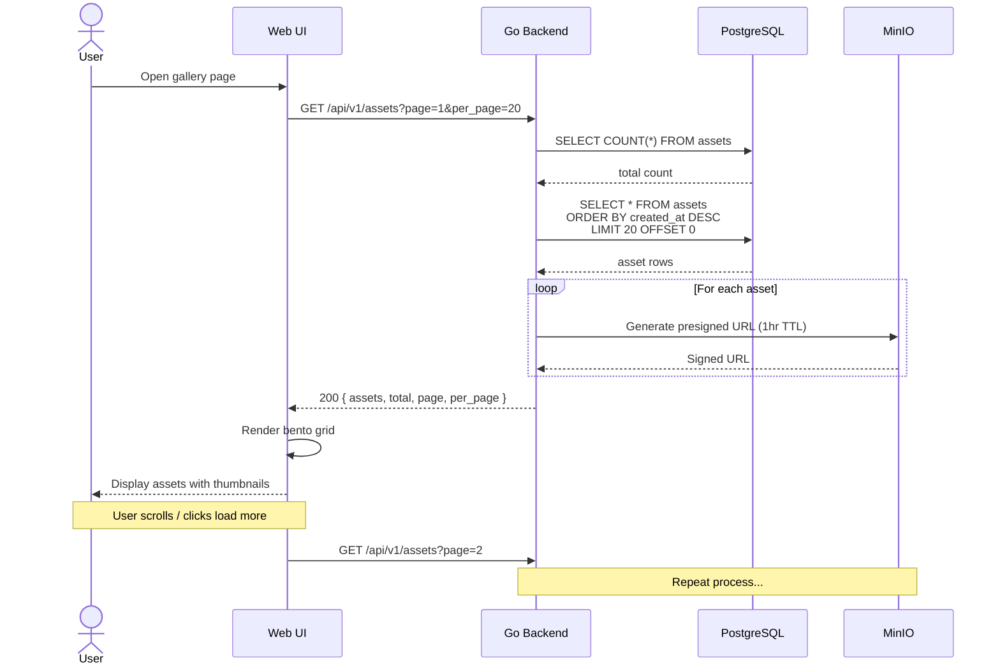
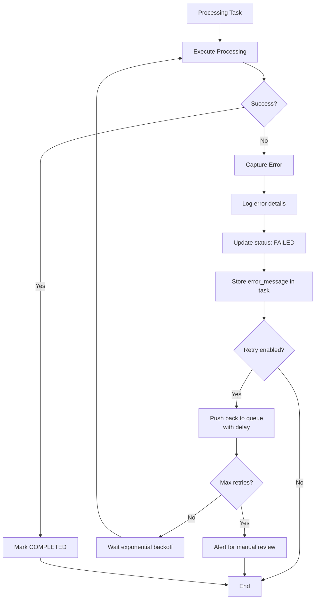
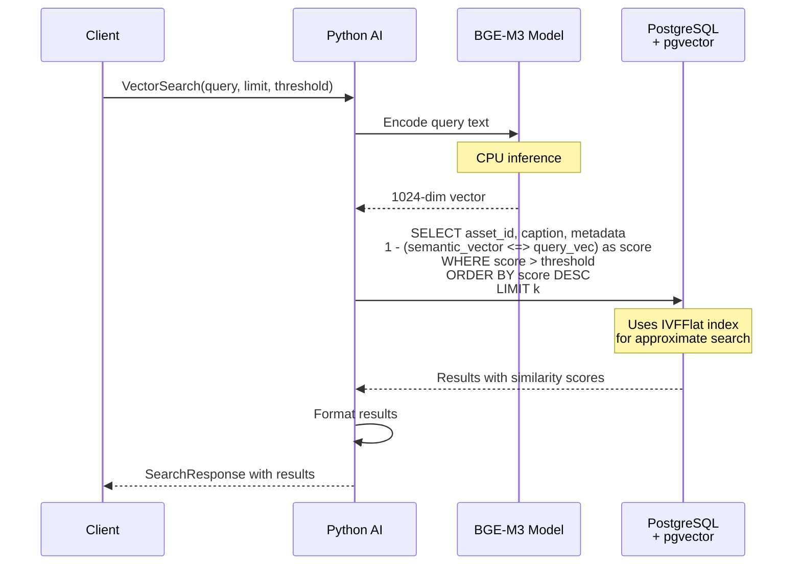

# Sequence Diagrams

This document illustrates the key workflows in ThinkBank using sequence diagrams.

## 1. Asset Upload Pipeline

The complete flow when a user uploads a file.



---

## 2. RAG Chat Flow

The flow when a user queries their knowledge base.



---

## 3. Asset Processing Worker Detail

Detailed view of the Python worker's processing logic.



---

## 4. Asset Retrieval Flow

How assets are retrieved for display in the gallery.



---

## 5. Error Recovery Flow

How the system handles processing failures.



---

## 6. Vector Search Flow

Detailed view of how similarity search works.



### Vector Search SQL Example

```sql
-- Cosine similarity search (smaller distance = more similar)
SELECT
    a.id,
    a.caption,
    a.mime_type,
    1 - (e.semantic_vector <=> '[0.1, 0.2, ...]'::vector) as score
FROM assets a
JOIN asset_embeddings e ON a.id = e.asset_id
WHERE 1 - (e.semantic_vector <=> '[0.1, 0.2, ...]'::vector) > 0.7
ORDER BY e.semantic_vector <=> '[0.1, 0.2, ...]'::vector
LIMIT 10;
```
