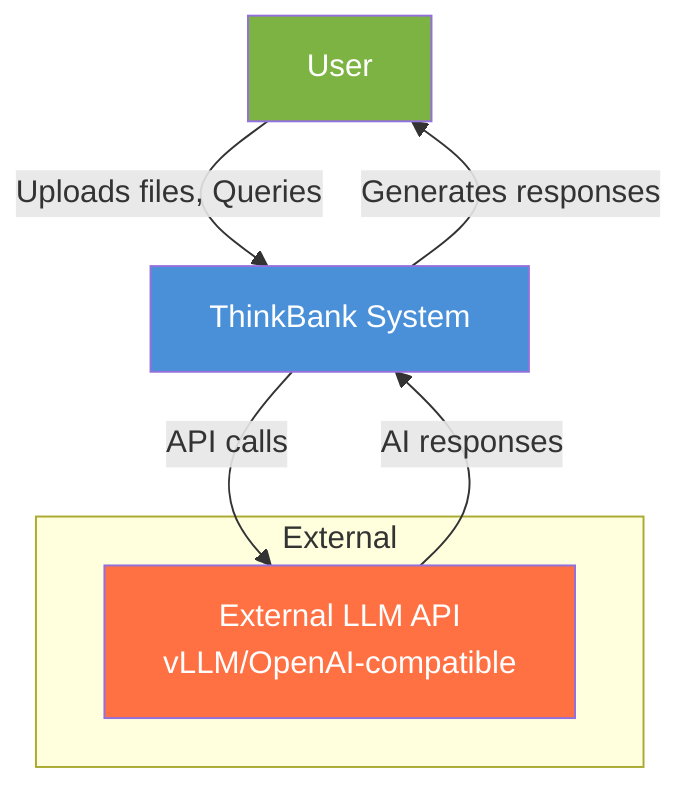
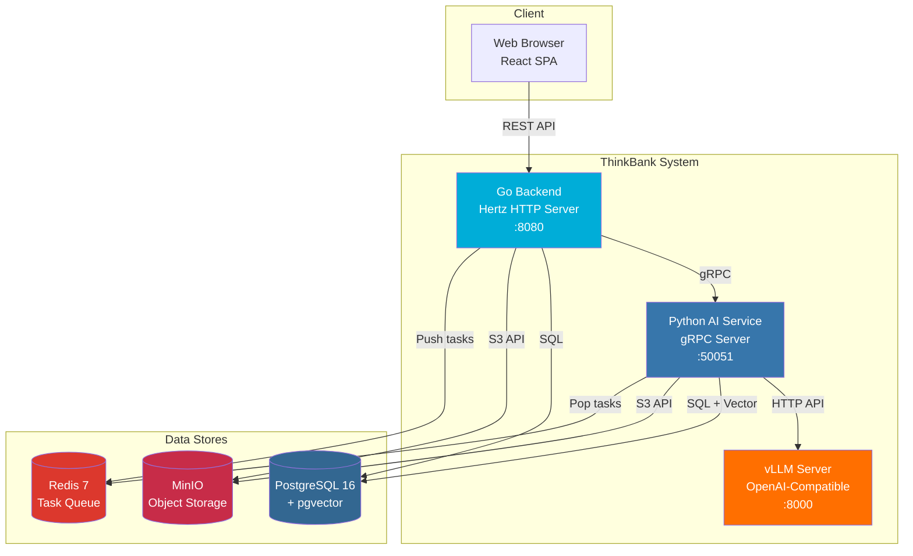
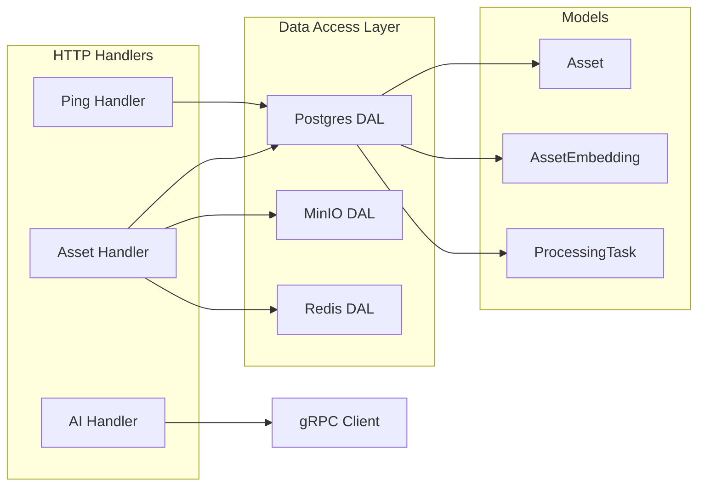
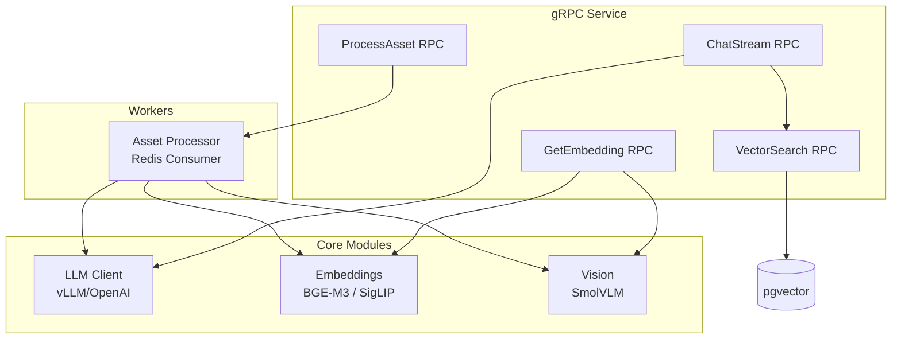

# System Overview

This document provides a high-level overview of the ThinkBank system architecture using the C4 model.

## C4 Context Diagram

The Context diagram shows ThinkBank in relation to users and external systems.



### System Description

**ThinkBank** is a self-hosted, privacy-first intelligent personal data asset management system that serves as:

- **Smart Gallery**: Automatically organizes and tags images
- **Second Brain**: Manages documents with semantic search
- **RAG Chat**: Conversational interface to query your knowledge base

### Key Characteristics

| Attribute | Description |
|-----------|-------------|
| **Data Sovereignty** | All data stays local - nothing sent to external clouds |
| **AI-Powered** | Local AI models for tagging, OCR, and search |
| **Hybrid Deployment** | Infrastructure in Docker, AI services on host (optional) |

---

## C4 Container Diagram

The Container diagram shows the high-level technical building blocks.



### Container Descriptions

| Container | Technology | Purpose |
|-----------|------------|---------|
| **Go Backend** | Go 1.25+, CloudWeGo Hertz | REST API server, asset management, authentication |
| **Python AI Service** | Python 3.11+, gRPC | AI processing pipeline, embeddings, RAG |
| **vLLM Server** | vLLM, Qwen2.5-7B | LLM inference for chat and summarization |
| **Web UI** | React 19, Vite | Single-page application frontend |
| **PostgreSQL** | PostgreSQL 16 + pgvector | Relational + vector storage |
| **MinIO** | MinIO | S3-compatible object storage |
| **Redis** | Redis 7 | Task queue for async processing |

---

## Component Diagram - Go Backend



---

## Component Diagram - Python AI Service



---

## Network Architecture

```
┌─────────────────────────────────────────────────────────────┐
│                        Docker Network                        │
│  ┌─────────┐  ┌─────────┐  ┌─────────┐  ┌─────────────────┐ │
│  │PostgreSQL│  │  MinIO  │  │  Redis  │  │ (Optional) App  │ │
│  │  :5432  │  │  :9000  │  │  :6379  │  │   Containers    │ │
│  └────┬────┘  └────┬────┘  └────┬────┘  └────────┬────────┘ │
└───────┼────────────┼────────────┼─────────────────┼─────────┘
        │            │            │                 │
        └────────────┴────────────┴─────────────────┘
                           │
        ┌──────────────────┼──────────────────┐
        │                  │                  │
   ┌────┴────┐       ┌─────┴─────┐      ┌────┴────┐
   │   Go    │       │  Python   │      │  vLLM   │
   │ Backend │       │    AI     │      │ :8000   │
   │  :8080  │       │  :50051   │      └─────────┘
   └─────────┘       └───────────┘
        │                  │
        └────────┬─────────┘
                 │
           ┌─────┴─────┐
           │  Web UI   │
           │   :5173   │
           └───────────┘
```

### Port Reference

| Service | Port | Protocol | Purpose |
|---------|------|----------|---------|
| Web UI | 5173 | HTTP | Frontend development server |
| Go Backend | 8080 | HTTP | REST API |
| Python AI | 50051 | gRPC | AI processing |
| vLLM | 8000 | HTTP | LLM inference |
| PostgreSQL | 5432 | TCP | Database |
| MinIO API | 9000 | HTTP | Object storage |
| MinIO Console | 9001 | HTTP | Admin UI |
| Redis | 6379 | TCP | Cache/Queue |
