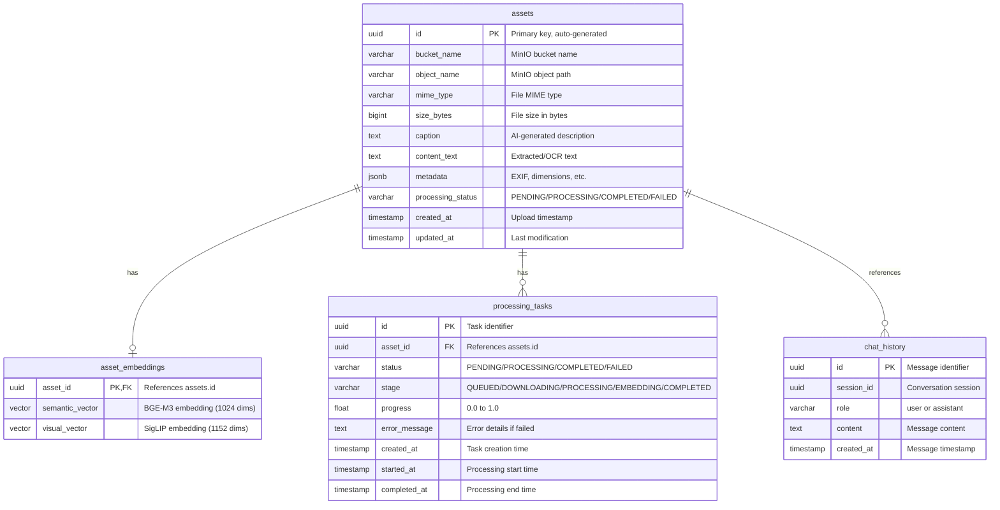
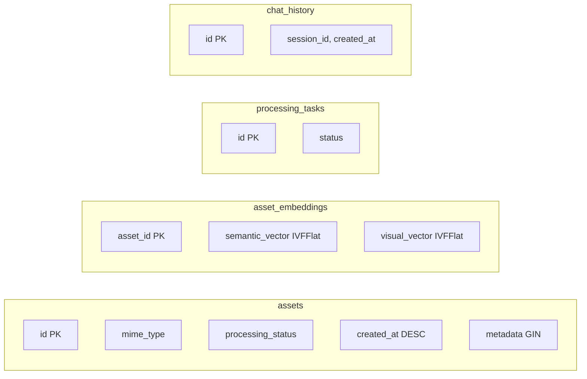

# Entity-Relationship Diagram

This document visualizes the database schema using Mermaid ER diagrams.

## Complete Schema



## Relationships Explained

### assets ↔ asset_embeddings (1:1)

- Each asset has at most one embedding record
- Embeddings are stored separately for performance
- **On Delete**: CASCADE (deleting asset removes embeddings)

### assets ↔ processing_tasks (1:N)

- Each asset can have multiple processing tasks (retries)
- Most recent task indicates current processing state
- **On Delete**: CASCADE

### chat_history (Standalone)

- Chat messages are independent of assets
- Grouped by `session_id` for conversation continuity
- Assets may be referenced in content (not enforced by FK)

---

## Index Strategy



### Index Details

| Table | Index Name | Type | Columns | Purpose |
|-------|------------|------|---------|---------|
| assets | `assets_pkey` | B-tree | `id` | Primary key lookup |
| assets | `idx_assets_mime_type` | B-tree | `mime_type` | Filter by file type |
| assets | `idx_assets_processing_status` | B-tree | `processing_status` | Filter by status |
| assets | `idx_assets_created_at` | B-tree | `created_at DESC` | Chronological ordering |
| assets | `idx_assets_metadata` | GIN | `metadata` | JSONB queries |
| asset_embeddings | `asset_embeddings_pkey` | B-tree | `asset_id` | FK lookup |
| asset_embeddings | `idx_semantic_vector` | IVFFlat | `semantic_vector` | Text similarity search |
| asset_embeddings | `idx_visual_vector` | IVFFlat | `visual_vector` | Image similarity search |
| processing_tasks | `idx_processing_tasks_status` | B-tree | `status` | Queue monitoring |
| chat_history | `idx_chat_history_session` | B-tree | `session_id, created_at` | Conversation retrieval |

---

## Vector Index Configuration

The IVFFlat indexes for vector similarity search use the following configuration:

```sql
-- Semantic vector index (BGE-M3, 1024 dimensions)
CREATE INDEX idx_semantic_vector
ON asset_embeddings USING ivfflat (semantic_vector vector_cosine_ops)
WITH (lists = 100);

-- Visual vector index (SigLIP, 1152 dimensions)
CREATE INDEX idx_visual_vector
ON asset_embeddings USING ivfflat (visual_vector vector_cosine_ops)
WITH (lists = 100);
```

### Parameters

| Parameter | Value | Explanation |
|-----------|-------|-------------|
| `lists` | 100 | Number of clusters for IVF indexing |
| `vector_cosine_ops` | - | Uses cosine distance (1 - similarity) |

### When to Reindex

Recreate indexes when dataset size changes significantly:

| Asset Count | Recommended `lists` |
|-------------|---------------------|
| < 10,000 | 10-50 |
| 10,000 - 100,000 | 100 |
| 100,000 - 1,000,000 | 200-500 |
| > 1,000,000 | 500-1000 |
