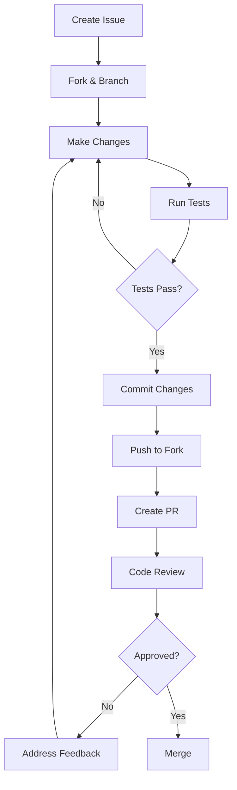

# Contributing Guide

Thank you for your interest in contributing to ThinkBank! This document outlines the process and guidelines for contributions.

## Table of Contents

- [Code of Conduct](#code-of-conduct)
- [Getting Started](#getting-started)
- [Development Workflow](#development-workflow)
- [Code Style Guidelines](#code-style-guidelines)
- [Commit Guidelines](#commit-guidelines)
- [Pull Request Process](#pull-request-process)

---

## Code of Conduct

- Be respectful and inclusive
- Focus on constructive feedback
- Help others learn and grow

---

## Getting Started

1. Fork the repository
2. Clone your fork: `git clone https://github.com/YOUR_USERNAME/thinkbank.git`
3. Add upstream: `git remote add upstream https://github.com/original/thinkbank.git`
4. Create a feature branch: `git checkout -b feature/my-feature`
5. Set up development environment (see [getting-started.md](./getting-started.md))

---

## Development Workflow



### Branch Naming

| Type | Pattern | Example |
|------|---------|---------|
| Feature | `feature/description` | `feature/add-user-auth` |
| Bug fix | `fix/description` | `fix/upload-error` |
| Documentation | `docs/description` | `docs/api-reference` |
| Refactor | `refactor/description` | `refactor/db-queries` |

---

## Code Style Guidelines

### Go

```go
// Use gofmt for formatting
gofmt -w .

// Use golangci-lint for linting
golangci-lint run
```

**Conventions:**
- Use meaningful variable names
- Handle errors explicitly (no ignored errors)
- Add comments for exported functions
- Follow [Effective Go](https://golang.org/doc/effective_go)

**Example:**
```go
// Upload handles file upload requests.
// It validates the file, stores it in MinIO, and queues for processing.
func Upload(ctx context.Context, c *app.RequestContext) {
    file, err := c.FormFile("file")
    if err != nil {
        c.JSON(consts.StatusBadRequest, errno.FileUploadErr)
        return
    }
    // ...
}
```

### Python

```bash
# Format with black
black .

# Sort imports
isort .

# Lint with ruff
ruff check .
```

**Conventions:**
- Follow PEP 8
- Use type hints for function signatures
- Use docstrings for modules and public functions
- Maximum line length: 88 characters (black default)

**Example:**
```python
def process_asset(asset_id: str, file_path: str, mime_type: str) -> ProcessStatus:
    """
    Process an asset through the AI pipeline.

    Args:
        asset_id: UUID of the asset
        file_path: Path to the file in MinIO
        mime_type: MIME type of the file

    Returns:
        ProcessStatus with success/failure information
    """
    # Implementation
```

### TypeScript/React

```bash
# Format with prettier
npm run format

# Lint with ESLint
npm run lint
```

**Conventions:**
- Use functional components with hooks
- Use TypeScript strict mode
- Prefer named exports
- Use Tailwind CSS classes (avoid custom CSS)

**Example:**
```typescript
interface AssetCardProps {
  asset: Asset;
  onClick?: () => void;
}

export function AssetCard({ asset, onClick }: AssetCardProps) {
  return (
    <div className="rounded-lg border p-4" onClick={onClick}>
      
      <p className="mt-2 text-sm text-gray-600">{asset.caption}</p>
    </div>
  );
}
```

---

## Commit Guidelines

### Commit Message Format

```
<type>(<scope>): <subject>

[optional body]

[optional footer]
```

### Types

| Type | Description |
|------|-------------|
| `feat` | New feature |
| `fix` | Bug fix |
| `docs` | Documentation only |
| `style` | Code style (formatting, etc.) |
| `refactor` | Code refactoring |
| `test` | Adding/modifying tests |
| `chore` | Maintenance tasks |

### Examples

```bash
# Good
feat(assets): add support for WebP image uploads
fix(upload): handle file size validation correctly
docs(api): update OpenAPI specification

# Bad
fixed stuff
update
changes
```

### Commit Best Practices

- Make atomic commits (one logical change per commit)
- Write clear, descriptive messages
- Reference issues when applicable: `fix: resolve #123`

---

## Pull Request Process

### Before Creating PR

- [ ] Code compiles without errors
- [ ] All tests pass
- [ ] Code is formatted and linted
- [ ] Documentation is updated (if needed)
- [ ] Commit messages follow guidelines

### PR Template

```markdown
## Description
Brief description of changes

## Type of Change
- [ ] Bug fix
- [ ] New feature
- [ ] Breaking change
- [ ] Documentation update

## Testing
Describe how you tested these changes

## Checklist
- [ ] Code follows style guidelines
- [ ] Tests added/updated
- [ ] Documentation updated
- [ ] No new warnings
```

### Review Process

1. **Automated checks** run on all PRs
2. **At least one approval** required from maintainers
3. **Address all review comments**
4. **Squash commits** before merge (optional)

### After Merge

- Delete your feature branch
- Update your local main: `git pull upstream main`

---

## Reporting Issues

### Bug Reports

Include:
- Description of the bug
- Steps to reproduce
- Expected behavior
- Actual behavior
- Environment (OS, versions)
- Logs/screenshots if relevant

### Feature Requests

Include:
- Use case description
- Proposed solution (if any)
- Alternatives considered

---

## Documentation Contributions

Documentation is in the `docs/` folder:

- Update relevant docs with code changes
- Use Mermaid for diagrams
- Follow Markdown best practices
- Check links work correctly

---

## Questions?

- Open a GitHub Discussion for general questions
- Open an Issue for bugs or feature requests
- Tag maintainers for urgent issues

Thank you for contributing! 🎉
