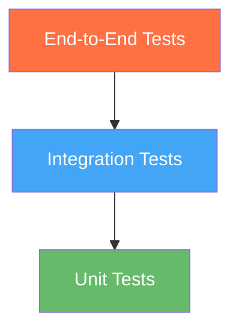

# Testing Strategy

This document outlines the testing approach and guidelines for ThinkBank.

## Testing Levels



| Level | Scope | Speed | Count |
|-------|-------|-------|-------|
| Unit | Individual functions | Fast | Many |
| Integration | Service interactions | Medium | Some |
| E2E | Full user flows | Slow | Few |

---

## Go Backend Testing

### Running Tests

```bash
cd go-backend

# Run all tests
go test ./...

# Run with coverage
go test -cover ./...

# Run specific package
go test ./biz/handler/...

# Run with verbose output
go test -v ./...

# Generate coverage report
go test -coverprofile=coverage.out ./...
go tool cover -html=coverage.out
```

### Test Structure

```
go-backend/
├── biz/
│   ├── handler/
│   │   ├── asset_handler.go
│   │   └── asset_handler_test.go
│   └── model/
│       ├── asset.go
│       └── asset_test.go
```

### Unit Test Example

```go
package handler

import (
    "testing"
    "github.com/stretchr/testify/assert"
)

func TestIsValidFileType(t *testing.T) {
    tests := []struct {
        name        string
        contentType string
        expected    bool
    }{
        {"JPEG image", "image/jpeg", true},
        {"PNG image", "image/png", true},
        {"PDF document", "application/pdf", true},
        {"Video file", "video/mp4", false},
        {"Executable", "application/x-executable", false},
    }

    for _, tt := range tests {
        t.Run(tt.name, func(t *testing.T) {
            result := isValidFileType(tt.contentType)
            assert.Equal(t, tt.expected, result)
        })
    }
}
```

### Integration Test Example

```go
package handler

import (
    "testing"
    "net/http/httptest"
    "github.com/cloudwego/hertz/pkg/app/test"
)

func TestUploadHandler(t *testing.T) {
    // Setup test server
    // ...

    // Create mock request
    req := httptest.NewRequest("POST", "/api/v1/assets/upload", body)
    req.Header.Set("Content-Type", "multipart/form-data")

    // Execute request
    // ...

    // Assertions
    assert.Equal(t, 200, w.Code)
}
```

### Test Database

Use a separate test database:

```bash
# Set test database
export POSTGRES_DB=thinkbank_test

# Run tests
go test ./...
```

---

## Python AI Service Testing

### Running Tests

```bash
cd python-ai

# Activate virtual environment
source venv/bin/activate

# Run all tests
pytest

# Run with coverage
pytest --cov=. --cov-report=html

# Run specific test file
pytest tests/test_embeddings.py

# Run with verbose output
pytest -v

# Run only unit tests
pytest -m unit

# Run only integration tests
pytest -m integration
```

### Test Structure

```
python-ai/
├── core/
│   ├── embeddings.py
│   └── llm.py
├── tests/
│   ├── __init__.py
│   ├── conftest.py           # Fixtures
│   ├── test_embeddings.py
│   ├── test_llm.py
│   └── integration/
│       └── test_grpc.py
└── pytest.ini
```

### Unit Test Example

```python
# tests/test_embeddings.py
import pytest
from core.embeddings import EmbeddingEngine

class TestEmbeddingEngine:
    @pytest.fixture
    def engine(self):
        return EmbeddingEngine()

    def test_encode_text_returns_vector(self, engine):
        """Test that encoding text returns a vector."""
        result = engine.encode_text("Hello, world!")

        assert result is not None
        assert len(result) == 1024  # BGE-M3 dimensions

    def test_encode_empty_text_raises_error(self, engine):
        """Test that empty text raises an error."""
        with pytest.raises(ValueError):
            engine.encode_text("")
```

### Fixtures (conftest.py)

```python
# tests/conftest.py
import pytest
from unittest.mock import Mock

@pytest.fixture
def mock_db():
    """Mock database connection."""
    return Mock()

@pytest.fixture
def sample_asset():
    """Sample asset for testing."""
    return {
        "id": "test-uuid",
        "mime_type": "image/jpeg",
        "bucket_name": "test-bucket",
        "object_name": "test/path.jpg"
    }
```

### Integration Test Example

```python
# tests/integration/test_grpc.py
import pytest
from grpc import insecure_channel
import ai_service_pb2
import ai_service_pb2_grpc

@pytest.mark.integration
class TestGRPCService:
    @pytest.fixture
    def stub(self):
        channel = insecure_channel('localhost:50051')
        return ai_service_pb2_grpc.AiWorkerStub(channel)

    def test_get_embedding(self, stub):
        """Test gRPC GetEmbedding endpoint."""
        request = ai_service_pb2.EmbeddingRequest(
            text="Test query",
            type=ai_service_pb2.EMBEDDING_SEMANTIC
        )

        response = stub.GetEmbedding(request)

        assert response.success
        assert len(response.semantic_vector) == 1024
```

---

## Frontend Testing

### Running Tests

```bash
cd web-ui

# Run tests
npm test

# Run with coverage
npm test -- --coverage

# Run in watch mode
npm test -- --watch

# Run specific test file
npm test -- src/components/AssetCard.test.tsx
```

### Test Structure

```
web-ui/
├── src/
│   ├── components/
│   │   ├── AssetCard.tsx
│   │   └── AssetCard.test.tsx
│   └── lib/
│       ├── api.ts
│       └── api.test.ts
└── vitest.config.ts
```

### Component Test Example

```typescript
// src/components/AssetCard.test.tsx
import { render, screen } from '@testing-library/react';
import { describe, it, expect } from 'vitest';
import { AssetCard } from './AssetCard';

describe('AssetCard', () => {
  const mockAsset = {
    id: 'test-id',
    file_name: 'test.jpg',
    mime_type: 'image/jpeg',
    size_bytes: 1024,
    processing_status: 'COMPLETED',
    url: 'https://example.com/test.jpg',
    created_at: '2024-01-15T10:00:00Z',
  };

  it('renders asset information', () => {
    render(<AssetCard asset={mockAsset} />);

    expect(screen.getByText('test.jpg')).toBeInTheDocument();
    expect(screen.getByText('COMPLETED')).toBeInTheDocument();
  });

  it('displays image when URL is provided', () => {
    render(<AssetCard asset={mockAsset} />);

    const img = screen.getByRole('img');
    expect(img).toHaveAttribute('src', mockAsset.url);
  });
});
```

### API Test Example

```typescript
// src/lib/api.test.ts
import { describe, it, expect, vi } from 'vitest';
import { uploadAsset, listAssets } from './api';

describe('API', () => {
  it('uploads file and returns asset ID', async () => {
    const file = new File(['test'], 'test.jpg', { type: 'image/jpeg' });

    const result = await uploadAsset(file);

    expect(result).toHaveProperty('asset_id');
    expect(result).toHaveProperty('message');
  });

  it('lists assets with pagination', async () => {
    const result = await listAssets({ page: 1, perPage: 20 });

    expect(result).toHaveProperty('assets');
    expect(result).toHaveProperty('total');
    expect(Array.isArray(result.assets)).toBe(true);
  });
});
```

---

## Test Coverage Goals

| Component | Target Coverage |
|-----------|-----------------|
| Go Backend | 80% |
| Python AI | 70% |
| Frontend | 60% |

### Check Coverage

```bash
# Go
go test -cover ./...

# Python
pytest --cov=. --cov-report=term-missing

# Frontend
npm test -- --coverage
```

---

## Continuous Integration

Tests run automatically on:

- Every push to `main`
- Every pull request

### CI Pipeline

```yaml
# .github/workflows/test.yml
name: Tests

on: [push, pull_request]

jobs:
  test-go:
    runs-on: ubuntu-latest
    steps:
      - uses: actions/checkout@v4
      - uses: actions/setup-go@v5
        with:
          go-version: '1.25'
      - run: cd go-backend && go test -v ./...

  test-python:
    runs-on: ubuntu-latest
    steps:
      - uses: actions/checkout@v4
      - uses: actions/setup-python@v5
        with:
          python-version: '3.11'
      - run: cd python-ai && pip install -r requirements.txt
      - run: cd python-ai && pytest -v

  test-frontend:
    runs-on: ubuntu-latest
    steps:
      - uses: actions/checkout@v4
      - uses: actions/setup-node@v4
        with:
          node-version: '20'
      - run: cd web-ui && npm ci
      - run: cd web-ui && npm test
```

---

## Best Practices

### General

1. **Write tests first** when possible (TDD)
2. **Test behavior, not implementation**
3. **Keep tests isolated** (no dependencies between tests)
4. **Use descriptive test names**
5. **Mock external dependencies**

### Test Naming

```go
// Good
func TestUploadHandler_ReturnsError_WhenFileTooLarge(t *testing.T)

// Bad
func TestUpload(t *testing.T)
```

```python
# Good
def test_encode_text_returns_1024_dimensional_vector():

# Bad
def test_embedding():
```

### What to Test

| Test | Skip |
|------|------|
| Business logic | Third-party libraries |
| Edge cases | Framework code |
| Error handling | Trivial getters/setters |
| Integration points | |

---

## Debugging Tests

### Go

```bash
# Run specific test
go test -run TestFunctionName ./...

# Debug with delve
dlv test ./... -- -test.run TestFunctionName
```

### Python

```bash
# Run with debugger
pytest --pdb

# Print on failure
pytest -v --tb=long
```

### Frontend

```bash
# Debug in browser
npm test -- --ui
```
